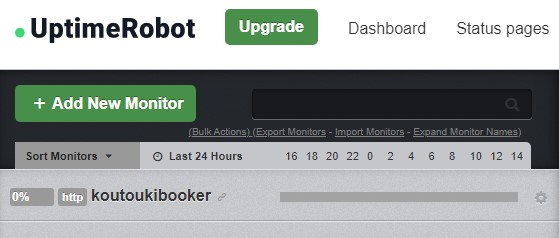
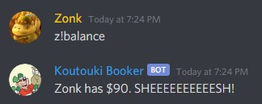
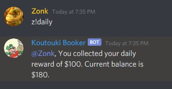
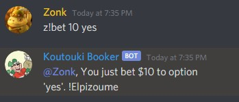
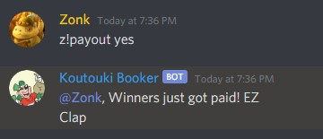

# Discord Betting Bot

This is a small personal project I created using **Node.js** and the discord Javascript framework, **discord.js**. It serves as a digital currency and betting system for any discord server as it allows it's users to make bets and check each other's balances.
I used **Mongo Db** as the project's database.

# Deploy

The project runs with the command *"node bot.js"*. It can be deployed online with any service such as deep ocean, glitch, repl.it, etc.
I used **Repl.it** and via **Uptime Robot** the bot stays awake so that it doesn't close from inactivity.

# Commands
**z!balance**
Check your or someone elses balance.

**z!daily** Get a set amount of money for the day.

**z!bet**
Bet the amount of money you would like to an option.

**z!payout**
Pay the winners of the bet.

